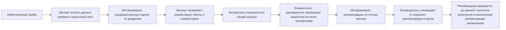

# Техническое задание

## Система внутренней экспертизы амбулаторного приёма с использованием ИИ («Осмотр»)

| | |
|---|---|
| **Версия документа** | 0.1 (черновик для обсуждения с рабочей группой) |
| **Дата** | 16.09.2026 |
| **Статус** | На согласование |
| **Заказчик** | Руководитель клинического аудита медицинской организации |
| **Пользователи системы** | Руководитель клинического аудита, эксперты внутреннего аудита |

---

## 1. Общие сведения

### 1.1 Наименование
Система внутренней экспертизы качества амбулаторного приёма с ИИ-поддержкой, рабочее название — **«Осмотр»**.

### 1.2 Назначение
Автоматизация и стандартизация внутренней экспертизы медицинской документации амбулаторного приёма с использованием ИИ в качестве вспомогательного инструмента эксперта, а также агрегированный анализ качества лечебно-диагностической помощи в организации за период.

### 1.3 Задачи, решаемые системой
1. Проведение экспертизы медицинской документации отдельного амбулаторного приёма.
2. Анализ качества лечебно-диагностической помощи, оказываемой в медицинской организации, за период (месяц).

### 1.4 Цели
- Снизить трудоёмкость и субъективность первичной оценки медицинской документации за счёт предварительной ИИ-оценки.
- Обеспечить единый, воспроизводимый оценочный лист по 5-балльной системе для всех экспертов.
- Дать руководителю клинического аудита инструмент для помесячного анализа качества работы врачей и организации в целом.
- Формировать конкретные, адресные предложения по улучшению работы врачей, обновлению клинических рекомендаций и выработке единого подхода.

---

## 2. Термины и определения

| Термин | Определение |
|---|---|
| Экспертиза | Оценка одного амбулаторного приёма экспертом (с ИИ-поддержкой) по оценочному листу |
| Оценочный лист | Набор разделов (критериев), каждый из которых оценивается по шкале 1–5 |
| Эксперт | Сотрудник, проводящий внутреннюю экспертизу медицинской документации |
| Руководитель клинического аудита | Пользователь, анализирующий результаты экспертиз за период и формирующий рекомендации |
| Стандарт для сверки | Внутренние клинические рекомендации медицинской организации, клинические протоколы МЗ РК либо материалы UpToDate, используемые как эталон при оценке объёма диагностики и лечения |
| ИИ-заключение | Предварительная оценка, сформированная ИИ до её утверждения/корректировки экспертом |
| Итоговая оценка | Оценка, утверждённая экспертом (может совпадать с ИИ-заключением или отличаться от него) |

---

## 3. Пользователи и роли

| Роль | Действия в системе |
|---|---|
| **Эксперт** | Вносит данные приёма, запускает ИИ-оценку, утверждает/корректирует баллы и комментарии, сохраняет экспертизу, просматривает журнал |
| **Руководитель клинического аудита** | Все действия эксперта, а также: просматривает аналитику за период, формирует и утверждает рекомендации по итогам месяца, работает с архивом рекомендаций |

> **Примечание.** В версии 0.1 разграничение прав между ролями не реализовано технически — все пользователи организации видят все вкладки и данные. Технически разграничение прав (например, запрет удаления записей для роли «эксперт») может быть добавлено отдельным требованием (см. раздел 12).

---

## 4. Целевой процесс

---

## 5. Функциональные требования

### 5.1 Модуль «Новая экспертиза»

**Входные данные, вносимые экспертом:**

| Поле | Тип | Обязательность |
|---|---|---|
| Врач | Текст | Обязательно |
| Отделение / специальность | Текст | Опционально |
| Дата приёма | Дата | Опционально |
| Тип консультации (очная / дистанционная) | Выбор | Обязательно |
| № карты / ID пациента (без ФИО) | Текст | Опционально |
| Содержание по каждому разделу оценочного листа (см. раздел 6) | Текст | Опционально, но требуется для содержательной оценки |
| Стандарт для сверки объёма диагностики/лечения | Текст | Опционально |
| Документы приёма (фото/скан записи приёма, заключения врача, PDF) | Файл | Опционально |

**Поведение системы:**
1. По команде эксперта («Провести экспертизу с ИИ») система передаёт введённые данные (включая приложенные изображения документов, если они есть) в ИИ и получает предварительную оценку — балл (1–5 или «неприменимо»), краткое замечание и конкретное описание правильного варианта по каждому разделу, а также общее заключение.
2. Раздел «Объективный осмотр» автоматически помечается как неприменимый, если консультация дистанционная.
3. Эксперт может изменить любой балл и любой текстовый комментарий, включая общее заключение, до сохранения.
4. Итоговый балл экспертизы = среднее арифметическое по применимым разделам.
5. При сохранении фиксируются: исходные данные приёма, приложенные документы, исходное ИИ-заключение (в неизменном виде, для аудируемости) и итоговая (утверждённая экспертом) оценка.
6. По каждому разделу с баллом ниже 5 фиксируются два поля: замечание (что не так и почему снижен балл) и конкретное описание, как должно быть сделано правильно.
7. После сохранения врач, которому проведена экспертиза, может оценить работу эксперта по 5-балльной шкале и указать, с чем конкретно не согласен; ответ врача сохраняется отдельно и виден в журнале.

### 5.2 Модуль «Журнал экспертиз»
- Список всех сохранённых экспертиз с фильтрами по врачу и по месяцу.
- Просмотр детализации: баллы и комментарии по каждому разделу, общее заключение.
- Удаление записи (с подтверждением) — для исправления ошибочно внесённых данных.

### 5.3 Модуль «Аналитика»
- Выбор периода (месяц).
- Показатели за период: количество проведённых экспертиз, средний итоговый балл, количество замечаний с баллом ≤ 3.
- Средний балл по каждому разделу оценочного листа (визуализация).
- Таблица по врачам: количество экспертиз, средний балл, наиболее слабый раздел.

### 5.4 Модуль «Рекомендации»
- Формирование ИИ сводных рекомендаций по итогам выбранного месяца на основе агрегированных данных всех экспертиз за период:
  - рекомендации по конкретным врачам (только там, где выявлены проблемы — средний балл ниже установленного порога хотя бы по одному разделу);
  - предложения по обновлению/уточнению клинических рекомендаций и протоколов;
  - предложения по выработке единого подхода среди врачей.
- Возможность сохранить сформированные рекомендации в архив и просмотреть архив за предыдущие периоды.

---

## 6. Оценочный лист (критерии экспертизы)

Шкала по каждому разделу: **1** — грубые нарушения/полное отсутствие данных, **5** — полностью соответствует, замечаний нет.

| № | Раздел | Что оценивается | Сверяется со стандартом |
|---|---|---|---|
| 1 | Анамнез | Полнота и последовательность сбора анамнеза заболевания и жизни | — |
| 2 | Объективный осмотр | Наличие и заполнение данных объективного осмотра — в медицинской документации раздел может называться «Текущий статус» или «Status praesens» (применимо только для очных консультаций) | — |
| 3 | Диагноз и код МКБ-10 | Формулировка клинического диагноза (основной, сопутствующий) и соответствие кода(ов) МКБ-10 диагнозу — оцениваются одним общим баллом, вносятся одним текстом, как в медицинской документации | — |
| 4 | Объём диагностики | Соответствие объёма назначенного обследования принятым стандартам | Внутренние клинические рекомендации организации / протоколы МЗ РК / UpToDate |
| 5 | Объём лечения | Соответствие объёма и состава назначенного лечения принятым стандартам | Внутренние клинические рекомендации организации / протоколы МЗ РК / UpToDate |
| 6 | Рекомендации врача | Обоснованность и полнота рекомендаций, данных пациенту | — |

По каждому разделу с баллом ниже 5 фиксируются два текстовых поля: **замечание** (конкретно, что не так и почему снижен балл) и **как должно быть правильно** (конкретное описание корректного варианта, со ссылкой на предоставленный стандарт, если он есть).

> **Открытые вопросы по составу оценочного листа** — см. раздел 13 (п. 3 раздела 11 снят по итогам пилотного тестирования, см. раздел 13).

---

## 7. Требования к ИИ-модулю

1. ИИ выполняет **вспомогательную** функцию: формирует предварительную оценку, которая не является окончательной и подлежит проверке экспертом. Ответственность за итоговое заключение несёт эксперт-человек.
2. ИИ не должен делать категоричных медицинских выводов о состоянии конкретного пациента — только оценивать полноту и соответствие оформления документации.
3. Формат ответа ИИ — структурированный (по каждому из разделов оценочного листа: балл + замечание, что не так + описание, как должно быть правильно (1–2 предложения каждое); плюс общее заключение 2–4 предложения). Если по разделу нет содержательного замечания, снижающего балл, поле «как должно быть» остаётся пустым (см. правило калибровки, раздел 11, п. 4).
4. Если эксперт предоставил применимый стандарт (внутренний протокол / протокол МЗ РК / выдержку из UpToDate), ИИ обязан сверять объём диагностики и лечения именно с этим стандартом; при отсутствии — использует общепринятые клинические подходы.
5. Если эксперт приложил изображения документации приёма (фото/скан), ИИ использует их как источник данных наравне с текстовыми полями; расхождения между изображением и текстом отмечаются в комментарии соответствующего раздела.
6. Тон ответа — деловой, доброжелательный, на русском языке.
7. Система должна корректно обрабатывать отказ или сбой ИИ-сервиса (недоступность, превышение лимита запросов и т.п.) без потери введённых экспертом данных, с понятным сообщением эксперту.

---

## 8. Модель данных

### 8.1 Запись экспертизы
- Метаданные: дата и время экспертизы, эксперт, врач, отделение, дата приёма, тип консультации, идентификатор пациента (без ФИО).
- Исходные текстовые данные по каждому разделу оценочного листа.
- Приложенные документы приёма (ссылки/идентификаторы файлов — фото, скан, PDF).
- Исходное ИИ-заключение (баллы + замечание + «как должно быть» + общее заключение по каждому разделу) — сохраняется как есть, для возможности сравнения с итоговой оценкой.
- Итоговая (утверждённая экспертом) оценка: баллы, замечания и «как должно быть» по каждому разделу, общее заключение, итоговый балл.
- Ответ врача (опционально): оценка работы эксперта по 5-балльной шкале, комментарий врача о несогласии, дата ответа.

### 8.2 Запись сводных рекомендаций
- Период (месяц), количество экспертиз за период, средний балл за период.
- Резюме, рекомендации по врачам, предложения по клиническим рекомендациям/протоколам, предложения по единому подходу.
- Автор (кто сформировал/утвердил), дата формирования.

### 8.3 Хранение и доступ
- Данные экспертиз и рекомендаций хранятся в общей базе, доступной всем авторизованным сотрудникам организации (эксперты и руководитель клинического аудита).
- В медицинскую документацию, вносимую в систему, **не включаются ФИО и иные прямые идентификаторы пациента** — только обезличенный номер карты/ID.

---

## 9. Нефункциональные требования

| № | Требование |
|---|---|
| 1 | **Конфиденциальность.** Персональные данные пациента (ФИО, точные идентификаторы) не вносятся в систему; допускается только обезличенный номер карты |
| 2 | **Аудируемость.** Исходное ИИ-заключение и итоговая оценка эксперта хранятся раздельно и не перезаписывают друг друга — должна быть возможность увидеть, что предложил ИИ и что утвердил эксперт |
| 3 | **Отказоустойчивость.** При недоступности ИИ-сервиса или хранилища данных система должна оставаться пригодной для работы в ограниченном режиме (без потери введённых данных в рамках текущей сессии) |
| 4 | **Производительность.** Формирование предварительной ИИ-оценки одной экспертизы — не более 1 минуты в типовом случае; формирование сводных рекомендаций за месяц — не более 2 минут |
| 5 | **Доступность интерфейса.** Корректное отображение на мобильных устройствах и настольных компьютерах, поддержка светлой и тёмной темы |

---

## 10. Ограничения и допущения

1. ИИ не имеет доступа к актуальной базе UpToDate или локальным протоколам МЗ РК в реальном времени — для точной сверки объёма диагностики и лечения эксперт должен самостоятельно предоставить релевантную выдержку из применимого стандарта.
2. Итоговое решение и ответственность за него — за экспертом-человеком; ИИ-оценка не может рассматриваться как окончательное заключение по качеству медицинской помощи.
3. В текущей версии не реализовано ролевое разграничение прав доступа (все пользователи организации имеют одинаковые права).
4. Система не заменяет и не дублирует функции медицинской информационной системы (МИС) — используется исключительно для целей внутреннего аудита.

---

## 11. Открытые вопросы (для согласования с рабочей группой)

Вопросы возникли по итогам пилотного тестирования оценочного листа на реальном кейсе и требуют решения до финализации ТЗ:

1. **Критерий «Глобальный диагноз».** Требуется уточнить: чем этот критерий отличается от критерия «Клинический диагноз» (раздел 6, п. 3), и при каких условиях он помечается как «неприменимо».
2. **Критерий «Выводы».** Нужен ли отдельный оцениваемый (по баллу) критерий общего соответствия приёма клиническим протоколам и стандартам — как дополнение к текстовому общему заключению, которое сейчас не имеет собственного балла.
3. ~~**Код МКБ-10 как отдельный критерий.** Уточнить, должен ли код МКБ-10 оцениваться отдельным баллом (как в текущем оценочном листе) или его оценка должна быть частью критерия «Клинический диагноз».~~ **Снято по итогам пилотного тестирования (см. раздел 13):** в медицинской документации диагноз и код МКБ-10 указываются вместе, в одном разделе — критерии объединены в «Диагноз и код МКБ-10» (раздел 6, п. 3), оцениваются одним баллом.
4. **Правило калибровки баллов.** Требуется явное правило: если эксперт оставляет содержательное замечание (например, рекомендацию по уточнению дозировки или срока контроля), но не считает это основанием для снижения итогового балла — критерий получает 5 баллов с примечанием. Это правило нужно закрепить явно и одинаково применять как экспертами, так и ИИ, чтобы избежать систематического занижения оценки ИИ относительно оценки эксперта.

---

## 12. Возможные направления развития (вне рамок текущей версии)

- Ролевое разграничение прав доступа (эксперт / руководитель клинического аудита).
- Экспорт журнала экспертиз и сводных рекомендаций в файл (например, для отчётности).
- Интеграция с МИС для автоматической подгрузки данных приёма вместо ручного ввода.
- Настраиваемые пороговые значения (например, порог «низкого балла» для аналитики и рекомендаций).

---

## 13. Приложение. Реализованный прототип

По итогам обсуждения реализован рабочий интерактивный прототип, реализующий разделы 5–8 настоящего ТЗ (форма ввода → ИИ-оценка → утверждение экспертом → журнал → аналитика за период → формирование и архив рекомендаций). Прототип используется как основа для пилотного тестирования и уточнения открытых вопросов (раздел 11) перед финализацией технического задания.

Прототип доступен по ссылке: https://claude.ai/artifact/KfLorbP2P5bybamobDfJVW

По итогам первой итерации пилотного тестирования в оценочный лист добавлено требование: по каждому критерию с баллом ниже 5 фиксируется не только замечание (что не так и почему снижен балл), но и конкретное описание, как должно быть сделано правильно. В конце оценочного листа добавлена возможность для врача, которому проведена экспертиза, оценить работу эксперта по 5-балльной шкале и указать, с чем он не согласен.

По итогам второй итерации пилотного тестирования на реальном кейсе внесены следующие изменения:
- Критерии «Клинический диагноз» и «Код МКБ-10» объединены в один критерий «Диагноз и код МКБ-10» (снят открытый вопрос раздела 11, п. 3) — в реальной медицинской документации диагноз и код указываются вместе, разделение приводило к ложным заключениям ИИ об отсутствии диагноза.
- Уточнена формулировка критерия «Объективный осмотр»: в документации соответствующие данные могут называться «Текущий статус» или «Status praesens» — это не отдельный раздел оценочного листа, а синоним того же содержания.
- Добавлена возможность прикладывать к экспертизе документы приёма (фото, скан, PDF); приложенные изображения передаются ИИ вместе с текстовыми полями при формировании оценки.
